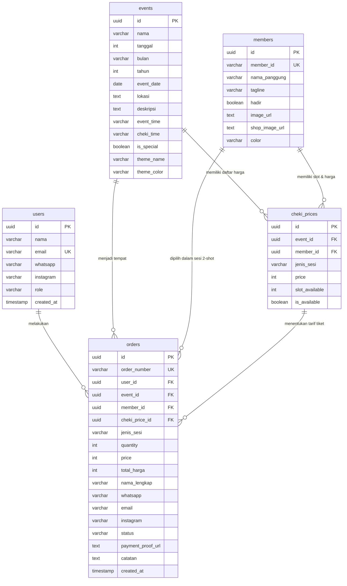

# Kohi Sekai - Project Structure & Architecture Guide

> **Catatan untuk AI Agent & Pengembang**: Dokumen ini merupakan sumber kebenaran (*single source of truth*) mengenai arsitektur sistem terbaru Kohi Sekai setelah transisi dari Refresh Breeze. Baca dokumen ini untuk memahami struktur frontend, routing, schema database, relasi entitas, flow transaksi langsung (tanpa keranjang), dan konvensi styling sebelum melakukan perubahan.

---

## 1. Brand Identity & Filosofi Desain

Kohi Sekai (**コーヒーの世界**) mengusung identitas bertema **Warm Coffee Kawaii & Sharp Industrial Metal**:
- **Tone & Rasa**: Kombinasi kehangatan kafe Jepang (espresso, latte cream, caramel) dengan energi idol musik live stage yang modern.
- **Konvensi Styling (Solid Colors, No Glassmorphism)**:
  - Seluruh efek *glassmorphism* (seperti `backdrop-filter: blur()`, kartu kaca transparan tembus pandang) telah **dihilangkan / diminimalkan**.
  - Menggunakan **warna solid tajam** berbasis CSS Design Tokens (`--background`, `--surface`, `--border`) untuk menjamin kontras, kenyamanan mata membaca lama, dan performa tinggi di perangkat mobile.

### Color Palette Tokens

```css
/* Light Mode (Soft Cream & Warm Coffee) */
:root {
  --primary: #F0A868;        /* Warm Coffee Orange */
  --secondary: #F5E6D3;      /* Milk Foam Cream */
  --accent: #FF6B9D;         /* Kawaii Berry Pink */
  --background: #FFF9F2;     /* Soft Warm Linen Background (Nyaman di mata) */
  --surface: #FAF2E8;        /* Solid Card Surface */
  --text-primary: #2B2420;   /* Deep Dark Roast Charcoal */
  --text-secondary: #736253; /* Warm Roasted Hazelnut */
  --border: #EADCCB;         /* Soft Cream Border */
  --success: #7BC47F;
  --danger: #E85D5D;
}

/* Dark Mode (Deep Coffee Metal) */
.dark {
  --primary: #E8944A;        /* Amber Glow */
  --secondary: #3A2E24;      /* Dark Espresso Roast */
  --accent: #FF85AC;         /* Vivid Neon Blossom */
  --background: #1A1512;     /* Deep Espresso Dark */
  --surface: #241E19;        /* Solid Dark Surface */
  --text-primary: #F5E6D3;   /* Warm Cream Light */
  --text-secondary: #B0A599; /* Muted Sand */
  --border: #3A2E24;         /* Subtle Dark Roast Border */
  --success: #6FAE73;
  --danger: #D65656;
}
```

---

## 2. Struktur Navigasi & Routing Frontend

Aplikasi frontend dibangun menggunakan **React 18 + Vite** dan **Tailwind CSS**.

### Halaman Utama (`src/pages/`)

| Path URL | Komponen Halaman | Deskripsi Fitur |
| :--- | :--- | :--- |
| `/` | [`KSHomePage.jsx`](file:///d:/Githab/isol/frontend/src/pages/KSHomePage.jsx) | **Home**: Hero section 16:9, Member Preview (3 member), Latest News, Upcoming Event poster showcase, Social Media links (IG/TikTok/YT), FAQ accordion, Footer. |
| `/about` | [`KSAboutPage.jsx`](file:///d:/Githab/isol/frontend/src/pages/KSAboutPage.jsx) | **About Us**: Filosofi Kohi Sekai, Galeri kartu 3 member utama (Latte, Macchiato, Affogato), Modal detail profil interaktif lengkap (hobi, jikoshoukai, ultah, medsos). |
| `/shop` | [`KSShopPage.jsx`](file:///d:/Githab/isol/frontend/src/pages/KSShopPage.jsx) | **Shop & Event Calendar**: Kalender bulanan interaktif dengan titik penanda jadwal, detail event terpilih, Banner Group Cheki, Chart Lineup Member dengan kuota slot & harga live. |
| `/checkout/:eventId` | [`KSCheckoutPage.jsx`](file:///d:/Githab/isol/frontend/src/pages/KSCheckoutPage.jsx) | **Direct Checkout (Tanpa Cart)**: Checkout 1 item tiket langsung dari event/member, formulir data fan terisi otomatis, petunjuk transfer bank, unggah bukti bayar, konfirmasi digital receipt. |
| `/music` | [`KSMusicPage.jsx`](file:///d:/Githab/isol/frontend/src/pages/KSMusicPage.jsx) | **Music**: Katalog discography single/album, pemutar cuplikan audio player, lirik lagu, dan tautan streaming ke Spotify/Apple Music. |
| `/login` | [`KSLoginPage.jsx`](file:///d:/Githab/isol/frontend/src/pages/KSLoginPage.jsx) | **Login / Register Fan**: Formulir autentikasi fan terpadu (nama, email, WA, IG), redirect otomatis ke halaman checkout / shop. |
| `/admin` | [`AdminPage.jsx`](file:///d:/Githab/isol/frontend/src/pages/AdminPage.jsx) | **Admin Command Center**: Manajemen event, member, harga cheki, orders, users, faqs, dan konfigurasi toko. |
| `/admin/login` | [`AdminLogin.jsx`](file:///d:/Githab/isol/frontend/src/pages/AdminLogin.jsx) | Halaman login otentikasi staf/admin. |

### Header Navbar Floating Pill Terpusat (`KSHeader.jsx`)
- Didesain dengan gaya **Floating Rounded Pill / Island** di tengah atas layar (`fixed top-3 sm:top-5 inset-x-0 max-w-5xl rounded-full`).
- Menggunakan warna solid `bg-surface border border-border shadow-xl shadow-text-primary/5` tanpa efek blur.
- Menu navigasi desktop berbentuk kapsul pill terpusat di tengah dengan indikator tombol aktif `bg-primary text-white shadow-sm`.
- Aksi terintegrasi: Toggle tema (Sun/Moon), Tombol "Masuk Fan" / Avatar Pengguna dengan menu dropdown ("Riwayat Pesanan Tiket" & "Keluar Akun"), serta Hamburger menu mobile yang membuka kartu rounded rapi di bawah navbar.

---

## 3. Schema Database & Entity Relationship

Database menggunakan **PostgreSQL (Supabase)** dengan tabel inti yang saling terhubung secara relasional:



### Tabel Rinci

1. **`users`**:
   - Menyimpan akun penggemar yang melakukan login/register.
   - Kolom: `id` (UUID PK), `nama`, `email` (UNIQUE), `whatsapp`, `instagram`, `role` ('fan', 'vip_fan', 'staff'), `created_at`, `updated_at`.
2. **`events`**:
   - Menyimpan jadwal panggung dan sesi temu idol.
   - Kolom: `id` (UUID PK), `nama`, `tanggal`, `bulan`, `tahun`, `event_date`, `lokasi`, `deskripsi`, `event_time`, `cheki_time`, `is_special`, `theme_name`, `theme_color`.
3. **`members`**:
   - Profil para idol Kohi Sekai (`latte`, `macchiato`, `affogato`, dll).
   - Kolom: `id` (UUID PK), `member_id` (VARCHAR), `nama_panggung`, `tagline`, `hadir`, `image_url`, `shop_image_url`, `color`.
4. **`cheki_prices`**:
   - Konfigurasi harga dan kuota per member per event.
   - Kolom: `id` (UUID PK), `event_id` (FK `events.id`), `member_id` (FK `members.id`, NULL = Group Cheki), `jenis_sesi`, `price`, `slot_available`, `is_available`.
   - Relasi Unik: `UNIQUE(event_id, member_id, jenis_sesi)`.
5. **`orders`**:
   - Catatan transaksi pembelian langsung tanpa keranjang.
   - Kolom: `id` (UUID PK), `order_number` (UNIQUE), `user_id` (FK `users.id`), `event_id` (FK `events.id`), `member_id` (FK `members.id`), `cheki_price_id` (FK `cheki_prices.id`), `jenis_sesi`, `quantity`, `price`, `total_harga`, `status` ('pending', 'verified', 'rejected', 'cancelled'), `payment_proof_url`, `catatan`, `created_at`.

---

## 4. Flow Pembelian & Checkout Multiline (`/checkout/:eventId`)

Sistem Kohi Sekai dirancang khusus untuk kenyamanan fans memesan tiket sesi cheki dengan struktur layout 2 kolom modern (Desktop) yang efisien dan mendukung pemesanan multi-item dalam satu order:

1. **Informasi Utama di Paling Atas (Full-Width Header)**:
   - **Nama Event / Jadwal Panggung**: Menampilkan nama event, tanggal, lokasi, dan sesi panggung.
   - **Informasi Pembeli (Read-Only)**: Menampilkan nama lengkap, email, WhatsApp, dan Instagram pengguna yang sudah terhubung. Tombol **"Ubah Profil"** mengarahkan pengguna ke halaman `/profile` untuk memperbarui data diri (tidak bisa diedit langsung di form checkout).

2. **Kolom Kiri (Desktop Layout - Step 1, 2, & 3)**:
   - **Langkah 1 (Pilih Lineup Member)**: Fans memilih idol favorit dari grid foto member (rasio 3:4) atau memilih opsi **Group Cheki (Full Member)**. Group Cheki diaktifkan secara global di Pengaturan Admin tanpa harus ditambahkan ke lineup individual event.
   - **Langkah 2 (Detail & Opsi Cheki)**: Menampilkan preview member terpilih, pilihan Tipe Polaroid (Regular Rp 40.000 / Wide Rp 70.000) serta **Opsi Harga Kustom Tambahan** yang dikonfigurasi secara fleksibel oleh Admin dari Dashboard, Opsi Kehadiran (2-Shot Hadir Event / 1-Shot Tidak Datang), dan Jumlah Tiket stepper.
     - *Catatan*: Field note individual telah dihilangkan dari card cheki di kolom kiri.
     - Fans mengeklik tombol solid **"Tambah ke Rincian Pesanan"** untuk memasukkan item ke dalam order cart. Langkah 1 & 2 dapat diulangi untuk menambahkan cheki member lain (multi-item dalam 1 transaksi).
   - **Langkah 3 (Metode Pembayaran)**: Menampilkan pilihan Transfer Bank (nomor rekening & tombol salin) atau Scan QRIS, serta dropzone upload bukti pembayaran.

3. **Kolom Kanan Sticky (Desktop Layout - Rincian Pesanan & Konfirmasi)**:
   - **Rincian Pesanan**: List seluruh item cheki yang sudah ditambahkan (member, tipe, opsi, qty, subtotal, dan tombol hapus item).
   - **SATU Kolom Catatan / Request Pose**: Field textarea tunggal di kolom kanan yang berlaku untuk keseluruhan pesanan (semua item dalam order ini).
   - **Total Akhir Pembayaran**: Menampilkan total harga secara akurat dari item yang ada di cart (`Rp 0` apabila rincian pesanan masih kosong).
   - **Tombol Action Utama**: Tombol solid `bg-primary` **"Konfirmasi & Bayar Sekarang"** untuk mengirim pesanan.


---

## 5. Ringkasan API Endpoints Backend

Backend Express berjalan di port `5000` (atau serverless Vercel melalui `api/index.js`):

| Endpoint | Method | Deskripsi | Hak Akses |
| :--- | :---: | :--- | :--- |
| `/api/auth/register` | `POST` | Registrasi akun fan baru ke tabel `users` (atau setup admin dengan secret). | Publik |
| `/api/auth/login` | `POST` | Login terpadu (Fan via email atau Admin via username & password). | Publik |
| `/api/auth/fan/login` | `POST` | Quick login/register fan (kompatibel dengan modal frontend). | Publik |
| `/api/auth/me` | `GET` | Validasi session token JWT & ambil profil pengguna aktif. | Authenticated |
| `/api/auth/fan/orders` | `GET` | Ambil riwayat seluruh pesanan fan berdasarkan email. | Publik / Fan |
| `/api/events` | `GET` | Ambil semua event panggung beserta lineup, galeri & `cheki_prices`. | Publik |
| `/api/events/:id` | `GET` | Ambil detail satu event lengkap dengan daftar harga cheki. | Publik |
| `/api/events` | `POST` | Buat event baru + inisialisasi harga cheki. | Admin |
| `/api/events/:id` | `PATCH/PUT`| Update data event dan lineup. | Admin |
| `/api/events/:id` | `DELETE` | Hapus event. | Admin |
| `/api/cheki-prices` | `GET` | Ambil daftar harga cheki (filter: `event_id`, `member_id`). | Publik |
| `/api/cheki-prices/:id` | `GET` | Ambil satu data tarif cheki. | Publik |
| `/api/cheki-prices` | `POST` | Buat opsi harga dan slot kuota sesi cheki. | Admin |
| `/api/cheki-prices/:id` | `PATCH/PUT`| Update harga, kuota slot (`slot_available`), dan ketersediaan. | Admin |
| `/api/cheki-prices/:id` | `DELETE` | Hapus tarif cheki. | Admin |
| `/api/cheki-prices/bulk-init/:eventId` | `POST` | Auto-seed tarif standar (Group + semua member aktif) untuk event. | Admin |
| `/api/users` | `GET` | Ambil daftar pengguna/fan dengan pencarian dan filter peran. | Admin |
| `/api/users/:id` | `GET` | Detail fan beserta riwayat transaksinya. | Admin |
| `/api/users` | `POST` | Daftarkan fan secara manual. | Admin |
| `/api/users/:id` | `PATCH/PUT`| Perbarui profil fan (nama, WA, IG, role). | Admin |
| `/api/users/:id` | `DELETE` | Hapus akun pengguna. | Admin |
| `/api/orders` | `GET` | Ambil daftar semua pesanan tiket (lengkap dengan join user, event, member). | Admin |
| `/api/orders/:id` | `GET` | Detail pesanan tiket. | Admin |
| `/api/orders` | `POST` | Simpan pesanan tiket hasil direct checkout, auto-link user & decrement slot. | Publik / Fan |
| `/api/orders/:id/status` | `PATCH` | Verifikasi status pembayaran pesanan ('verified', 'rejected', dll). | Admin |
| `/api/members` | `GET` | Ambil daftar idol member aktif Kohi Sekai. | Publik |
| `/api/upload` | `POST` | Unggah bukti transfer atau foto aset ke Supabase Storage. | Publik / Fan |

---

## 6. Petunjuk Menjalankan Proyek Secara Lokal

1. **Backend**:
   ```bash
   cd backend
   npm install
   npm run dev
   # API berjalan di http://localhost:5000
   ```
2. **Frontend**:
   ```bash
   cd frontend
   pnpm install
   pnpm run dev
   # Website berjalan di http://localhost:3000
   ```
3. **Database Migration**:
   File SQL lengkap tersimpan di [`database/migration-v2-full.sql`](file:///d:/Githab/isol/database/migration-v2-full.sql).
